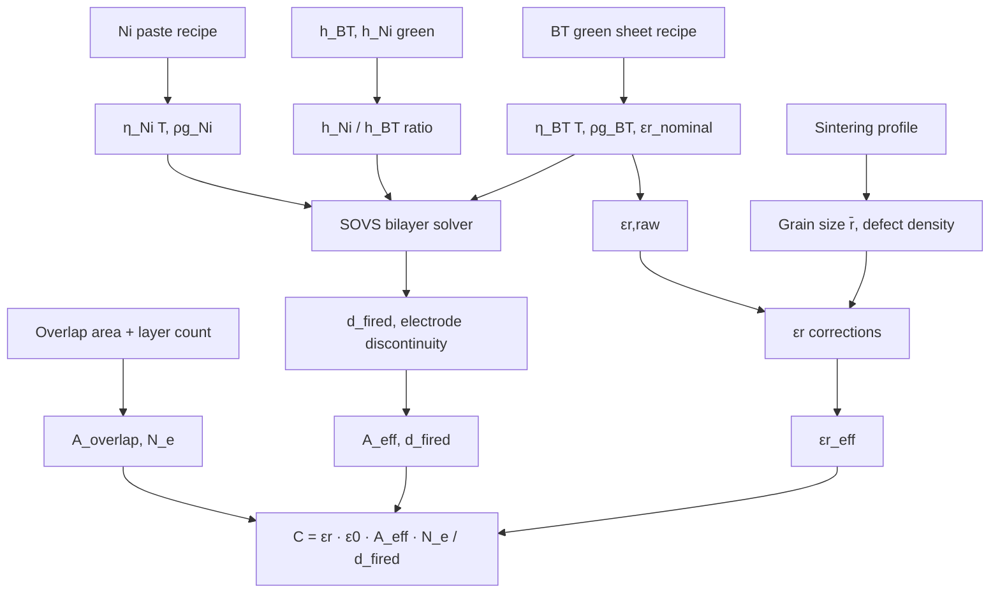

# Can MLCC capacitance be simulated from recipe + geometry?

**Yes, with three accuracy tiers depending on how deep you model.** All the pieces are in the wiki; this is the central pipeline that the simulator has been built toward.

## Master equation

From [[mlcc-capacitance-equation]]:
$$
C \;=\; \varepsilon_r \cdot \varepsilon_0 \cdot \frac{A_\text{eff} \cdot N_e}{d_\text{fired}}
$$

The simulation is well-posed if you can compute each of the four terms on the right from the user inputs. The wiki covers all four.

## Mapping each input to each output term

| User input | Feeds into | Wiki pages |
|---|---|---|
| Ni paste recipe (Ni size, BT additive size + vol%, refractory dopant) | `η_Ni(T)` → constraint stiffness → electrode discontinuity → `A_eff` reduction | [[ni-electrode-paste-formulation]], [[sugimura-hirao-2009-batio3-additive-ni-electrode]], [[metal-electrode-shrinkage-effect]] |
| BT green sheet recipe (powder size, dopant package, glass aid, organic vol%) | `η_BT(T)` + `ε_r` corrections + green density `ρ_g` | [[batio3-powder-synthesis]], [[core-shell-batio3]], [[dopant-site-occupancy-batio3]] |
| Green sheet thickness `h_BT,green` | `d_fired = h_BT,green · (1 − s_total)` where `s_total = 1 − (ρ_g / ρ_f)^(1/3)` + drying + burnout | [[green-density-vs-shrinkage]], [[green-tape-shrinkage-anisotropy]] |
| Overlap area `A_overlap` (electrode geometry) | `A_eff = A_overlap × coverage_fraction × (1 − discontinuity)` | [[case-size-geometry]], [[dielectric-shrinkage-in-mlcc-stack]] |
| Stack layer count `N_e` | Direct factor; plus stack-thickness budget `H ≤ H_max − 2·d_cover` | [[case-size-geometry]] §"Height & layer count budget" |

## Three-tier pipeline

### Tier 1 — Geometric (back-of-envelope, ±15–20 % accuracy)

```
d_fired   = h_BT,green × (1 − s_total)
            where s_total ≈ 0.12 for typical Samsung X5R BME stack
A_eff     = A_overlap × 0.80      (assumes 20 % discontinuity loss)
ε_r_eff   = ε_r,nominal            (from dielectric class; X7R ~2200, X5R ~2500)
C         = ε_r_eff × ε_0 × A_eff × N_e / d_fired
```

The 20 % discontinuity loss comes directly from the [[yan-thesis-2013-mlcc-sintering-nanotomography|Yan thesis]] observation that "an average discontinuity of 15 % causes around 20 % capacitance loss." Already useful for ranking design candidates.

### Tier 2 — Material-corrected (±10 % accuracy)

Adds the dielectric-physics corrections from existing wiki pages:
- **`ε_r(T)`**: TCC envelope per [[eia-rs-198-dielectric-classes]] (e.g., ±15 % for X7R over −55…+125 °C).
- **`ε_r(V_DC)`**: DC-bias derating sigmoid `f_VCC(E) = 1/(1+(E/E₀)^p)` per [[dc-bias-derating]] — typical losses 30–80 % at rated voltage.
- **`ε_r(t_age)`**: aging clock per [[aging-class-2]] (~1–5 %/decade for X7R).
- **`ε_r(grain size)`**: drops below 1000 at 50 nm grains per [[srep-batio3-grain-size-unfolding]]; design `d_fired ≥ 3–5 · d_grain` per [[core-shell-batio3]].
- **`ε_r(domain wall)`**: cooldown TEC stress modifies [[ferroelectric-domain-wall]] population — small correction.

This is **the same model that commercial vendor SPICE tools use** (SimSurfing, K-SIM, SpiCap — see [[vendor-spice-models]], [[murata-spice-library-and-curves]]). Tier 2 is the level where the wiki is currently "complete" for the simulator.

### Tier 3 — Process-physics-coupled (±5 % accuracy, research frontier)

Recipe inputs determine the process-derived parameters through the sintering trajectory. Solving this requires the [[skorohod-olevsky-viscous-sintering|SOVS]] continuum model on a per-layer mesh ([[shi-2023-jecs-sovs-bilayer-modeling|Shi 2023]] proved it's laptop-scale):

```
1. From Ni paste recipe → η_Ni(T), ρ_g,Ni  (dilatometry calibration required)
2. From BT green sheet recipe → η_BT(T), ρ_g,BT
3. From h_BT, h_Ni, h_Ni/h_BT → constraint stiffness factor (Jean-Chang / SOVS)
4. From sintering profile → SOVS integration
   → d_fired (constrained thickness; ~2.5× thickness enhancement vs free)
   → grain size r̄  (from T × t × dopant pinning per
                    [[grain-growth-dopant-pinning]])
   → ε_r(r̄)  (drop below critical grain size)
   → electrode discontinuity (Yan DEM lookup or SOVS surface)
   → A_eff = A_overlap × (1 − discontinuity − margin_loss)
   → pore-orientation-induced ε_r correction
5. C = ε_r(r̄, T, V_DC, t) × ε_0 × A_eff × N_e / d_fired
```

Every block has at least one wiki concept page; many have multiple sources backing them.

## Pipeline diagram



## What's calibrated vs predicted

| Parameter | Method | Wiki source |
|---|---|---|
| `ε_r,nominal` for a dielectric class | Empirical lookup (C0G ~30, X5R ~2500, X7R ~2200) | [[eia-rs-198-dielectric-classes]] |
| `s_total` for green-to-fired shrinkage | Calculate from `ρ_g, ρ_f` + drying + burnout | [[green-density-vs-shrinkage]] |
| `η_Ni(T), η_BT(T)` | **Calibration required** — one free-tape dilatometry run per recipe | [[skorohod-olevsky-viscous-sintering]] |
| Electrode discontinuity vs `h_Ni, D_Ni0, T_heating` | Yan DEM lookup table or SOVS surface | [[layer-thickness-and-metal-ceramic-ratio]] |
| `ε_r` corrections (T, V_DC, age, grain) | Empirical sub-models from wiki pages | [[dc-bias-derating]], [[aging-class-2]] |
| Cofiring camber / warpage | SOVS-FE | [[shi-2023-jecs-sovs-bilayer-modeling]], [[cofiring-camber-bilayer]] |

## Honest assessment

- **Tier 1 is essentially solved** — straightforward arithmetic with default discontinuity allowance.
- **Tier 2 is solved at the same fidelity as commercial vendor SPICE models** (SimSurfing, K-SIM, SpiCap — see [[vendor-spice-models]]).
- **Tier 3 is the research frontier.** The wiki has the physics laid out, but practical Tier-3 prediction requires:
  - A SOVS-FE implementation (open-source DAWN, or Sandia's; Shi 2023 published methodology).
  - **Per-recipe `η(T)` calibration** from free-tape dilatometry — this is the irreducible measurement requirement.
  - A grain-growth model coupled to the sintering profile (existing literature; see [[grain-growth-dopant-pinning]]).
  - Validation against measured fired parts (the iterative loop).

What the wiki cannot do without new ingests:
- **Predict `ε_r,nominal` from dopant composition alone.** Requires DFT or empirical fit to a specific vendor's data. Currently `ε_r,nominal` is a lookup, not a prediction.
- **Predict reliability** (TTF, IR drift) from the recipe. The [[bme-reliability-model|Liu BME framework]] is there, but its parameters (`α, n, E_a`) are calibration constants from accelerated life test data — there's no first-principles route.

## Bottom line

For a **design simulator that ranks recipes and predicts capacitance within ±10 %**, Tiers 1 + 2 are sufficient and entirely covered by the existing wiki. For **physically grounded predictions of process-induced deviations**, Tier 3 is the right framework; the wiki currently has the conceptual scaffolding and the SOVS implementation path published. The bottleneck is calibration measurements (free-tape dilatometry per recipe), not modeling capability.

## Open gaps worth ingesting

- **`ε_r` from dopant composition (DFT / empirical models).** Currently the simulator treats `ε_r,nominal` as a class-level lookup; a recipe-aware model needs ingestion of e.g. Park / Hong DFT studies and the Hennings dopant-composition-to-Curie-point correlation.
- **Grain-growth kinetics under realistic BME sintering profiles.** Wiki has [[grain-growth-dopant-pinning]] but no quantitative `d_grain(T, t, dopant)` model.
- **Validation data**: measured `C, ε_r, d_fired, discontinuity` for a single recipe across a range of `h_BT, h_Ni`. Industry data (Murata, SEMCO, TDK) exists in vendor datasheets; pulling enough into the wiki to calibrate Tier 3 would complete the loop.

## Cross-references

- [[mlcc-capacitance-equation]] — the master equation.
- [[dielectric-shrinkage-in-mlcc-stack]] — the five mechanisms by which the lamination reshapes BT shrinkage.
- [[layer-thickness-and-metal-ceramic-ratio]] — quantitative scaling table for h_BT / h_Ni effects.
- [[skorohod-olevsky-viscous-sintering]] — the FE framework for Tier 3.
- [[shi-2023-jecs-sovs-bilayer-modeling]] — proves Tier 3 is laptop-tractable.
- [[ni-electrode-paste-formulation]] — paste recipe inputs.
- [[green-density-vs-shrinkage]] — green-to-fired thickness mapping.
- [[dc-bias-derating]] — Tier-2 voltage-derating correction.
- [[vendor-spice-models]] — commercial Tier-2 reference implementations.
