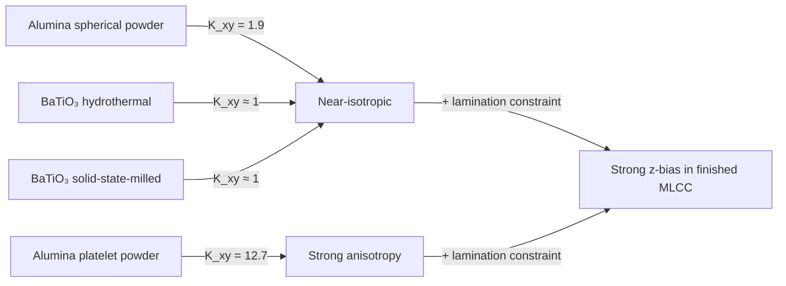

# Is shrinkage less related to material shape with BaTiO₃?

**Short answer: yes — and meaningfully so.** Powder-shape-driven shrinkage anisotropy is a much smaller effect for BaTiO₃ than for alumina under similar tape-casting conditions. The reason traces to BT's synthesis routes and crystal habit, not to any difference in sintering physics.

## Why shape *should* matter (and does, for alumina)

[[heunisch-2010-tape-cast-anisotropic-shrinkage|Heunisch, Dellert, Roosen 2010]] ran a clean factorial study on **alumina** (all d₅₀ ≈ 4 µm). Shrinkage anisotropy factor `K_xy` varied dramatically with particle shape:

| Powder shape | K_xy (alumina) | In-plane shrinkage | Thickness (150 µm gap) |
|---|---|---|---|
| Platelet (CL 3000) | **12.7** | 2.7–3.9 % | ~11 % |
| Standard (WRA FG) | 8.4 | similar | ~9 % |
| Spherical (DAW 05) | **1.9** | ~isotropic | ~6–11 % |

Mechanism: platelet particles align flat-down in the shear field at the doctor blade, so the sintering shrinkage budget is biased into the thickness direction. **Binder MW and casting speed had only minor effects** — particle morphology dominated.

## Why BT bucks the trend

For BaTiO₃ MLCC tapes:

1. **Commercial BT is not platelet-shaped.** The two dominant synthesis routes used in BME MLCC ([[batio3-powder-synthesis]]) produce roughly equiaxed particles:
   - **Hydrothermal** ([[murata]], increasingly [[samsung-electro-mechanics]], Sakai Chemical): single-crystal grains, narrow distribution, no anisotropy bias — the typical 100 nm BT particle is closer to a faceted cube than a plate.
   - **Solid-state-milled** (Korean/Chinese second-tier): agglomerated and irregular, but **not systematically anisotropic** — milling randomizes orientation.

2. **Raj 1999** (*J. Am. Ceram. Soc.* 82:1199) explicitly tested tape-cast BT under the same casting conditions that produce strong anisotropy in alumina and **did not see the same effect**.

3. **Hagymási's DT (DuPont 951, alumina + glass) free-shrinkage anisotropy** was 12.7 / 13.9 / 12.8 % — only a **9 % x–y asymmetry** even on alumina with realistic LTCC process conditions. For commercial-grade BT, the in-plane asymmetry is even smaller (effectively at the noise floor of optical dilatometry).

## What still creates anisotropy in BT tapes

Per [[green-tape-shrinkage-anisotropy]] and [[constrained-sintering-mlcc]]:

| Source | Effect on BT | Notes |
|---|---|---|
| **Powder shape** | small / negligible | The Heunisch result does not transfer to BT |
| **Tape thickness (blade gap)** | small-moderate | Thinner green tapes still shrink more in z than thick |
| **Constrained sintering in the laminate** | **dominant** | Lateral suppressed ~4× and thickness enhanced ~2.5× — see [[hagymasi-ltcc-ferrite-dielectric-cofiring|Hagymási]] DT/FT/DT data (12.8 % free → 33.1 % constrained thickness) |
| **Green-density gradient through thickness** | binder-burnout camber | Cured by 0.5 K/min BBO ramp — see [[binder-burnout-debinding]] |

## Quantitative comparison

In the finished MLCC, the **stack constraint dominates** intrinsic powder anisotropy regardless of which oxide it starts from.

## Bottom line for the simulator

For BME MLCC dielectric tape made from hydrothermal or carefully milled solid-state BT:

- **Do not include a powder-shape term** in the free-shrinkage anisotropy budget. Treat free BT-tape shrinkage as essentially isotropic.
- **Do include** the lateral-vs-thickness redistribution from the [[skorohod-olevsky-viscous-sintering|SOVS]] viscous-Poisson-ratio term — that is where the real anisotropy in a finished MLCC comes from.
- The Heunisch K_xy = 12.7 (platelet) result is a **bound on the worst case** if a BT vendor delivers an unusually anisotropic powder, but not a representative number for a normal BME process.

The asymmetric stress field from constrained sintering in the laminate is **dominant**; intrinsic green-tape anisotropy in BT is a second-order correction.

## Open questions / gaps in the wiki

- No primary source for the Raj 1999 BT result; we have it via secondary citation in recent reviews. Worth tracking down the original paper if shape effects become important for a future model.
- Whether **textured BT tapes** (template-grain-growth route, recent Tsinghua / Penn State work) reintroduce anisotropy by design — those use plate-like seed crystals to align the (001) ferroelectric axis. Different regime, but worth a future ingest.
- Quantitative dilatometry on hydrothermal vs solid-state BT free tapes — would tighten the "negligible anisotropy in BT" claim.

## Cross-references

- [[green-tape-shrinkage-anisotropy]] — main wiki page; cites this contrast
- [[heunisch-2010-tape-cast-anisotropic-shrinkage]] — the alumina study
- [[hagymasi-ltcc-ferrite-dielectric-cofiring]] — alumina + glass tape data
- [[batio3-powder-synthesis]] — why BT particles are equiaxed
- [[constrained-sintering-mlcc]] — where the real anisotropy actually comes from
- [[skorohod-olevsky-viscous-sintering]] — quantitative continuum prediction
